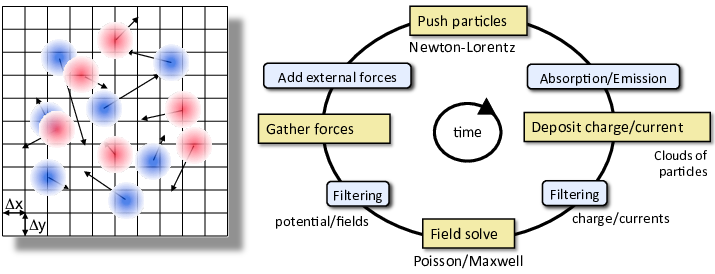

.. _theory:

Overview
========

.. _theory-pic:

WarpX simulates the **self-consistent** evolution of **particle species** (e.g., electrons, ions, etc.) in the presence of **electric and magnetic fields**.
In this context, *self-consistent* indicates that the particle dynamics are influenced by the fields, while the fields themselves evolve in response to the particles' changing charge and current density.

The fields are represented on a **discrete spatial grid** (see :ref:`theory-grid`).
The species are most commonly represented by **discrete macroparticles** moving continuously through the grid, but can also be represented as **fluids** discretized on a grid (see :ref:`theory-species_representations`).

At each **time step** of a simulation, both the species and the fields are updated -- using the equations of motion and the field equations respectively.
More specifically, the following operations are performed at each time step, as represented in the figure below:

   - The electric and magnetic fields are interpolated from the grid to the macroparticles (or to the nodes of the fluid grid, for species represented as fluids)
   - These fields are used in the equation of motion to update the macroparticles' position and momentum (or the fluid density and velocity)
   - The species deposit their charge density and/or current density onto the grid.
   - The fields are updated on the grid using the field equations, with the charge and/or current density as source terms.

.. _fig-pic:

   Schematic high-level representation of the Particle-In-Cell (PIC) algorithm.

In WarpX, different types of field equations can be used to update the fields (e.g., Maxwell's equations for fully-electromagnetic field update, Poisson equation for electrostatic field update, etc.).
This choice -- and the choice of a corresponding field solver -- determine many of the algorithmic details of the above loop (see :ref:`theory-models_algorithms`), such as the maximum time step size, the exact time-stepping algorithm, and whether the species' charge density or current density is used.

.. _theory-models_algorithms:

Models & Algorithms
===================

.. toctree::
   :maxdepth: 1

   models_algorithms/electromagnetic_pic
   models_algorithms/electrostatic_pic
   models_algorithms/kinetic_fluid_hybrid_model

.. _theory-grid:

Grid & Geometries
=================

.. _theory-species_representations:

Species Representations
=======================

.. toctree::
   :maxdepth: 1

   kinetic_particles
   cold_fluid_model

Boundary Conditions
===================

.. toctree::
   :maxdepth: 1

   boundary_conditions

Multiphysics Processes
======================

.. toctree::
   :maxdepth: 1

   multiphysics_extensions

Advanced Modes of Running
=========================

.. toctree::
   :maxdepth: 1

   amr
   boosted_frame

.. bibliography::
    :keyprefix: i-
